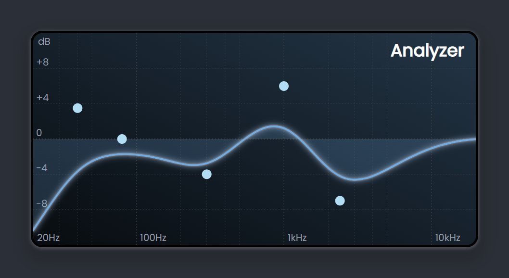

# Demo Project of the DSSSP: React Library of Audio Processing and Visualization

This is the collection of demos for the DSSSP library. Explore various themes and configurations across four setups bundled as a single React application.

For more details, visit the original [repository](https://github.com/numberonebot/dsssp) of the DSSSP library and its [documentation](https://dsssp.io/docs).

## Installation

```bash
# Clone the repository
git clone https://github.com/numberonebot/dsssp-demo.git

# Navigate to the project directory
cd dsssp-demo

# Install dependencies
npm install

# Start the application
npm run dev
```

## Screenshots




## Tracklist

Tracks used for the first demo:

- **BalloonPlanet** - _Cool My Bass_
- **Seth Parson** - _Waiting_
- **Gidon Schocken** - _I Owe It to You_
- **Adam Simons** - _Lost You_

Acquired from [Artlist.io](https://artlist.io), and should not be copied, distributed, or used for any commercial purposes.
